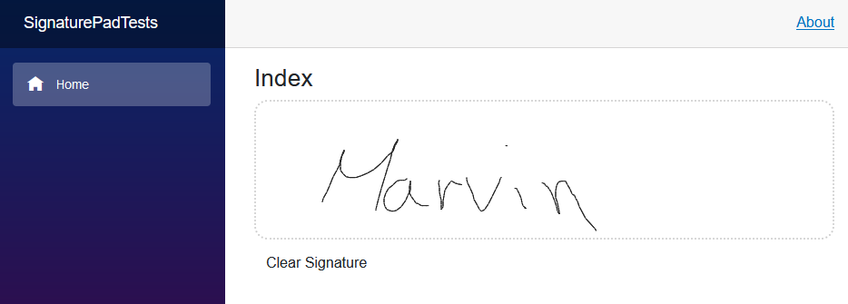

# SignaturePad
A simple to use blazor component to draw a signature. It supports both mouse and touch inputs and works on Blazor Server and Blazor WebAssembly.

See a live [demo](https://marvinklein1508.github.io/SignaturePad/) right here on github.



## Installation

You can install from Nuget using the following command:

`Install-Package Blazor.SignaturePad`

Or via the Visual Studio package manger.

## Basic usage
Start by adding the following using statement to your root `_Imports.razor`.
```razor
@using SigPad
```

Next you should define a property in your class. For example:
```csharp
public class MyInput
{
    public byte[] Signature { get; set; } = Array.Empty<byte>();
}
```

You can then use it wherever you want.
```razor
<SignaturePad @bind-Value="Input.Signature" style="width: 100%" />
```

The control provides you the image data as base64 `byte[]`

To get the image, you'll need to convert to `byte[]` into a string. For example:

```csharp
public class MyInput
{
    public byte[] Signature { get; set; } = Array.Empty<byte>();
    public string SignatureAsBase64 => System.Text.Encoding.UTF8.GetString(Signature);
}
```

## Providing options
You can configure the SignaturePad by providing a `SignaturePadOptions` instance to the component. 

```razor
<SignaturePad @bind-Value="Input.Signature" Options="_options" style="width: 100%" />

@code {
    public MyInput Input { get; set; } = new();

    private SignaturePadOptions _options = new SignaturePadOptions
    {
        LineCap = LineCap.Round,
        LineJoin = LineJoin.Round,
        LineWidth = 20
    };
}
```

## Using existing base64 strings
By default the SignaturePad prefixes the signature with `data:image/png;base64, `. When Loading existing base64 strings, this prefix should be applied like this:

```cs
Input.Signature = Encoding.UTF8.GetBytes("data:image/png;base64, iVBORw0KGgoAAAANSUhEUgAAALgAAAA5CAYAAACF3+G6AAAAAXNSR0IArs4c6QAADlZJREFUeF7t3QOULFkSBuB/1rZt27Zt88zatm3be9actW3bmLVtz25+b+7dyZed1ZXVXV1d3ZVxTp3u1y95b9y4EX/8EbVPRpnHCBwuyY2T+Pm3JP8sn88m+eqEG5wiyVmSnC7JX5NcJslxkhwqyeGTHKVc7x9J9kvyqSRfT/KOeTzwqlxjn1V50Rnf8xBJLlAU7YxJTp3k4ElOleT0SQ5b/j3jZfccXpX/CBs5uZzzsyTvTPKlJN9sFscnkvx2E9fbtaeuqoKfO8kxk5w1yX+SXDDJ2ZIcq8w0q3noGWb9L0k+k+S/nXMsjON2/kbBWekvJvllscz/Luf/uaXAf2wtrPOXBed5j9HzXH8vC47Cn2OG5971h+5WBadA10py1OIGnKYoM8s7RCjqp4vr8MPG/fheOekH5XeL4pPFGg+53jyPsaNcOMlJyqI8UZKTl4Vql7lEs2DfO88b7uRr7SYFv3qzZV8tyfnK5E+bl/2TfCPJ54oy2+p9dqrcorHuT0tiEZ6pxAI79V3m9tw7VcE998WSXKgJ4q6Z5LTrjIgAToDGhfh4kh8VhZ7bIC7JhcQNFixr/ook11uS59rWx9hpCn6TJJdqLO111xk1fihFptTcjC9v6wgv9uaXTPL24o8fLcnvFnv75bvbsis4H/oGJdjifnQDNiMqUHtr44++Kcm7kwj4VlU+WHY1wapgVLC80rJsCn70EhyetKAG5+2ZHSgELPg9ST6wYhZ6PWW1u72wBJvXTvK6ldbs8vLLoOCUmttxj4J49M0LP/otDQ798sZCvS/Jn8bJ22sEDpbkF8VqSzSdOcm3xzFKtkvBKTWX4zolWOybC760BMb7iwsyKnW/xoIJH9Eo9PXLf3+k4PqjfmfxCg6fvn+Smyc5dmcGYMvvKpZaoFSx53GiJo+A9P5zkpywdciTktx5HLQDR2BRFhy34m5J7pXkMJ3B/07zt0c12O3rx6h/sFoeOclDmvT8HTpnvLHBwW86juNBo7IIBb9Zkof1WGzZNpP04Z4U9+CZXsEDuXfiEMmcKjKvt0zyghJkruCw9L/yViq4dPLDG+gOj6ItgkWWfBLLbpycySMgbnlykhO0DpF95ap8fxy4PSMg0fXgJJ/HvtwqBWeVsfHa8qEmAfHQAu+NczHbCKDOMha3aZ12QBnPR49p+T2uNsLcrZNco/EYZHX3yLwVHP563waDRQiqgjV3nyRvm21Ox6ML41GiS9DYDiRZa1bqxaN7t0fXnlBIZmuUZl4KfvbGx35mA+eds3MHNxZcdmmko/auPwIXKUZB6r0tFWlCrPrxOIi5XZKnrjMO+29WwW2dTynp9Pa1pMtvleSl4yQMGgGFFJT5cuXTd9K3ikvyyiT446su4FFw8ySR6d53Mwp+hlJKpfSqLYhOkg4jjj1dBRVdcOsmWSHsQEG5tDviGAs+SvL0TjzSHRP6xxAcsFEFv2xTS/jqJO2yK4P/xOKD44uMMnkEUH3Bp11WJMssQEeaQnlltUfZewRuVGKPvnH5TXGT/29cN6LgttI3lILYehM1gvwhyZpRJo+AJMw9CzuyfRQWpBgG0mSSRukfAexSFI42TOpIhkGxx+O7scmsCs5X/FizpUo2VPlp2WZxIEZZOwJcuTs2BRdXKFXz9YifNxP1vIYC/OwxYBysNiBRpLy20DvGFVq3RmZRcL42eurxW1dBhgJh+TnK3iPAjVMXisbaFq0kJGte0yS8FAuPMmwEGAhUBMxJwmrbDSF1E2WIglNoK+TurVYJYD/EKJi3Cdutos+JXUt1vJ+q7i/aEJyOl0Qx8jMKddcY8JcZgSs3f7trpzgDqsT9sI2O+YDZtAXO/YCSwKlnSnJR7sdNu9Q0BddK4WVNRKoqvS0a0IABTdpOEe961VKUrOBYkx3tI9BwfU5Z+NS451o2oBg4R6X6EEEa6yJKvyoICDqrWtBRho+AxNZjypx1W3hAlNTjTt0B11NwlhtM1W1Q86+SqVymCvRDllStthCCYD/1EKG0sPrNyK8b6/GVcgEBjjrHk/Vg/+17aMqjukbl0R82c/MVPFfxy/2KIWJc6JvAm0Eivy8GV4HHVFlPwcFUChLaov7RFv21qVfe2AGiZK4QBT1i6f8hiKCosqVWbLW4Wp4R25Xaw6E9T+qTCZYrnKnHSbUGLLEsocoYil1rPLVZU8EvuQC/7go35bUFfx2JT7PPP5IUvF81UhV1AY8tXbwYMaKeADt1kExScExAAWVbrCSOPt97MwKBQcTiAtjSNaqhzPMQgcdHCzXgC8V6QivsROIG/zc0CwiKumLTN+VKha3X93yuBft/0RYu+nmMyzJfgxEVm1RkjrHiFkOXdEZg9Npt6biQiGfO4UquK5MUHOTS5RtbOS48RDysFmI+tnMBGriMlZ2lJVr7XmoMf9JwW1SMo0Ky3FwGf7O6q2IPeb5JxwhoLLwbDuyEZZdz7JhhnG3UzZe+LTjstbCcsVD4AmHiFrbF+Fb0pP6dHjBeFoTzemkhfQpui2D92sICCsi6K4ZC2LaP1HBS9OGorkTdTmZ57errUljKDHrkNvi5le0PNNPEdlTb2KX4eg7tF1iRthgHC15yxs42yrAREA/dtlQi1T6QDJXEoVzBJAIZC96dg/YdZS4Z0jXSp+BWli2iLR4KJEYJQGCUuq9HybTX5Nfyd61WiguNkSjCX9lKJa7PpXQOUw+UZ1eBDrVrQy1kHbDwGCxa49AdI36iSiS7xyjDRgDMum8TIN6p7Lb1LArNx8YtWW8XxC15Vg/gUa/DECrjW0MR6VNwW3Q7Kymos5XAwvX9GyIelgLzoTTlYeUEdUP93yH3mHYMmEkgSpGR4blIFmUbVRE0W3CvKotNn0LBrOQBGKotIFG4/5ixnTbyB/3/uYrFxmlvuxj8aCiTrKTfh4h5E+jj8VgschFEbKXQ+i59F+lT8Iu3qm6cDBbjfkwTllitoAenBIsmXCnn4jJduiiy7qttwZfhetU+hRIzbTKTYmgIDtej62JpXeH6IKpR1h8BrgJOyFUmHAZhErdsxlCI5bjMBKLHUPVKV8EnJXb6TuYrA9xZaogLS7gIYY3tJCy0Ags+NNejKwJRrDzsPM/meSeJYBH+2l3Idi8FG88fA8l1p9b4S/zZ5bmx3YDQyeBXASQDuLD2elXBBYd4x7bzScLtEHTxT+GTtvN5uxwWmK3HznHisiWpr6N8nrVuS91n1DLY83CHYNdDFpsgR/SN4dcV7yrm4B+OGcjJOgGQQPn1odh9AulAklKgMNQdmZuhpDRdn7t7cXAM3oVVKqtpJVJA1pFfZDsH/WnqU9PaFN95ol+LRyDHDxdI+uk8GT4+WrWaAtBpyZrvlkIKCuw5LDjw4CzCx9ZPBK+4K9wqC9iEbFUya5ZnXdZjQcj4IXqyTxJGR45AK4tt60pGwc9TUIxFDCaFB7FZIAagLQaBFa7CZ0YHoHQC1M2IRBIeCmsNRemKLROic/uRGbnuMGtPwThgSvYJyI/b+sjS7Xfba3Gri+KBuQGsqmwlK0e0eRA4enDKZhtq+7v+LaioqEkbE8YVoDTbKRrjCxxly/p2B0Hjc4srghg1yt4jgP+hwBnMJyGj62+fME7iGHCffuzbrtj1IftQFNhv/XYAK1ESZKcJJAjmarH2CRfH1skvHOWgEbDT4feDSAXwcgHrSeW2q+RaWOA4y4T1KbgqeVs1UQzb7X83y/UXeSygHxGKta47UPf+0BAJA8mcUQ7cjWHUfGoV/bK2077eUHz15qIb4NOllj4FxyMBnHM7ZC2XvUYQ3i0Bo3qmz+JAQbgh0updjsNST84WPRx4lTLfuyBVQ28DZmXwNBuCjOwImVbwsMwvIViEhKAN9FkdboiKDxTWVRZVSfBprE2AwlDmpgQf6Bi3XVH0xGTKMg/uTlNw2HjlZPdh9iYFcQd+vd0B7nbMu6DQrivw56YBAYbOMYxaHoFCS9ypelqaYHGjgzn05Td6/XmdJ1gUC3RbmdXrs9aCYz72wpMJ83rJDV4HwkExFQxsRKTM9TmU8V0E4W0jz7jhc5ZdwXEWwHztZp71ZU2MLVRipoupb3hAduCJxqHbonroa/CndazdtUZhGRWcG4ItpvNTl5Ira6mjFvbfoJq8oTO9g4+DCE1CjbxWpaH6KdsMzkP5pdxyHLtalkHBKbSUr0QCS9RVapkxkwGSGtPna9Xx8o178pJSEADxQl+gxJWGUSuo0C2UeXHj2iVgo4JvwQiwzgIiHN5upQbyOguD0LXfbt4+5ziuLDPCE0wbUtJGlXCGjKUax5Wj+y7KgiNhoZ0KFLuMQBZHZYeqHtE73slSZsXmqJDzuBT4j6FAR0BVbQsECdFJgfgqxyeDIaSNTojI3tdK8KlrJQ2+Cg65Dk+CxNpzZKP3WJXz1ItCkbhyfWiSQnFjygXBuhxlBox01sGSLVO3WPvywVNZZ99UzP2AV4+y/ghURZbQEptwQ9rClaPQAm/YP9x6lM4IzNNFUVkD1kPUqt8nQ7ElDpSBjfyPyeoHBtWJi/vGlTMv3eoiCoypx4Xz2UzJ18oshHkouIIHVNo2lRIkpU8Ftt5mudy7aTIgGgyAdDmrrCiaG9el8qInMwjqR7V/gyTtyFT5dk/ePBRcSZlApgaPkgYmBuPMNsrnxjNHihJsWhA+6vZqIyDkHRCXifVMrgGj3UnlYpQWr75WN1WLDPZUDd79huf23Au0KTQLzZVTHK3CaZRNjsA8FNwjYPE9sHCJ53XNIa/GBerezxfMon1aLFXZplFA2/cCpakiomBS15XzIjC2M6GLYlyyvu3i2r5n6b6DMj4cauV2dj3Y/ui6DZnpDR4zb2V8UCk0wM3ezULxawKllmlVi2sB2MHsXPV3C0ajoJVJsCzL5P8Pkg7Vm1kdRBkAAAAASUVORK5CYII=");
```

## Custom styling
You can customize the looks of SignaturePad by either overriding the CSS classes or by specifiying your own classes.

For the SignaturePad itself you can use the `Class` parameter and for the button to clear the SignaturePad you can use the `ClearButtonClass` parameter.

